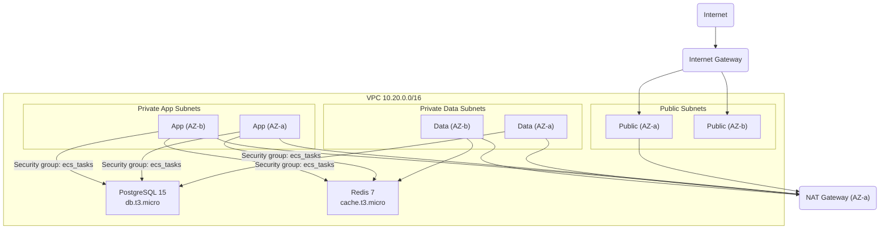
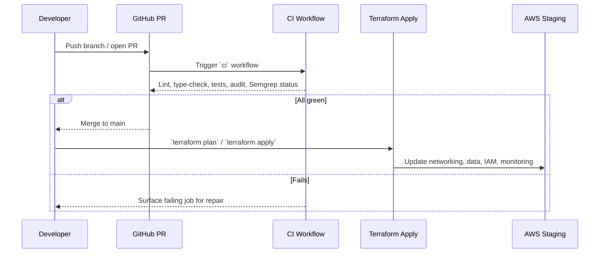

# Infrastructure Overview

BerthCare's infrastructure decisions follow the same lens as the product: make the tooling invisible, question defaults that hide risk, and own the entire stack end to end. Everything below is current for staging and is the template for subsequent environments.

## Repository Layout

| Path                                             | What lives here                                                                   | Why it exists                                                                         |
| ------------------------------------------------ | --------------------------------------------------------------------------------- | ------------------------------------------------------------------------------------- |
| `apps/backend`                                   | Express / TypeScript API that targets ECS Fargate.                                | Keeps service logic close to infra definitions so schema and runtime evolve together. |
| `apps/mobile`                                    | React Native app (Expo) that ships the offline-first experience.                  | Shared repo keeps client + server aligned on API contracts.                           |
| `libs/shared`, `libs/utils`                      | TypeScript packages consumed by backend and mobile.                               | Encourages code reuse while owning shared SDK surface.                                |
| `infra/terraform/environments/staging`           | Terraform for AWS networking, data stores, IAM, and observability.                | Infrastructure as code makes stack ownership explicit and reviewable.                 |
| `.github/workflows/ci.yml`                       | Quality gate (lint, type-check, test, audit, Semgrep).                            | Invisible tooling: every PR proves it is safe before humans read it.                  |
| `docker-compose.yml`, `Makefile`, `.env.example` | Local replicas of Postgres, Redis, S3 (via LocalStack) plus bootstrap automation. | Questions defaults by matching cloud topology locally instead of relying on mocks.    |
| `project-documentation`, `design-documentation`  | Architecture blueprint, research, and design artefacts.                           | Keeps rationale close so infra choices stay grounded in caregiver needs.              |

## CI/CD Pipeline

- GitHub Actions workflow `ci` runs on every pull request to `main`, cancelling in-progress runs per branch to keep feedback fast.
- Steps: checkout, Node.js 20 with Corepack, deterministic `pnpm install`, then `pnpm run lint`, `pnpm run type-check`, `pnpm run test -- --runInBand --ci`, a dependency audit (switching between npm/pnpm automatically), and Semgrep SAST (`p/ci` ruleset).
- The workflow enforces invisible tooling by blocking merges until quality signals pass; humans only review once the stack is already healthy.
- Releases promote through code review + merge. Infrastructure updates run from the Terraform directory (`terraform plan`/`apply`) so operators explicitly own each change.

## AWS Staging Environment (Terraform)

### Environment Snapshot

- Region: `ca-central-1` to meet Canadian data residency promises.
- Tagging: `Project`, `Environment`, and `ManagedBy` applied to every resource for cost and audit traceability.
- Budgets: Single NAT gateway and burstable `t3` classes keep the monthly run rate near $200 while still mirroring production topology.

### Network Topology

- VPC `10.20.0.0/16` with two Availability Zones. Public subnets host ingress (ALB, NAT), private application subnets run compute, and isolated data subnets house RDS and ElastiCache.
- Internet Gateway + single-AZ NAT question the default of “NAT per AZ” to balance resiliency with cost. Route tables pin data subnets to stay private (no default route to the internet).
- Security groups: `ecs_tasks` allow outbound-only; `rds` and `redis` only trust the ECS task security group on their respective ports.

### Runtime & Access Control

- Compute will run on ECS Fargate tasks that assume the provisioned `berthcare-staging-ecs-task` role; the execution role pulls images and writes logs, the task role owns S3 + SSM access.
- Security groups enforce least privilege while still keeping operational tooling invisible: operators look at Terraform rather than a console UI to confirm ingress rules.

### Data Layer & Storage

- PostgreSQL 15 (`db.t3.micro`, encrypted) for the source of truth, with automated backups (7-day retention), maintenance windows, and connection metrics exported via CloudWatch.
- Redis 7 (`cache.t3.micro`, in-transit + at-rest encryption) for session and cache workloads. Auth tokens rotate automatically thanks to Terraform-managed secure strings.
- S3 bucket `berthcare-staging-<account>` is private, versioned, KMS-encrypted, and transitions infrequently accessed objects to `STANDARD_IA` after 30 days—owning lifecycle costs explicitly.

### Secrets & Configuration

- SSM Parameter Store maintains `SecureString` values for the database password and Redis auth token. Applications retrieve them through IAM policies instead of embedding secrets.
- Default KMS alias for SSM handles decryption; policies allow only ECS tasks to call `kms:Decrypt`, reflecting the “own the stack” mandate.

## Monitoring & Observability

- CloudWatch Log Group `/aws/ecs/berthcare-staging/backend` (30-day retention) keeps JSON logs structured—no default text logs—so metric filters stay precise and cheap.
- Metric filters emit `RequestCount`, `ErrorCount`, and `APILatency` into the `BerthCare/API` namespace. Dashboards chart latency percentiles, error rates, and RDS connections.
- Alarms: API error rate >1% and p95 latency >2s fan out through the `berthcare-staging-alerts` SNS topic; wiring subscribers is deliberate (question the default of email noise).
- Sentry instrumentation (backend and mobile) activates once DSNs are populated in `.env`. Combined with CloudWatch, the runtime view stays centralized and invisible until something breaks.

## Deployment Flow

- Developers create PRs; the CI quality gate proves the change is production-worthy before reviews.
- After merge, operators run Terraform from `infra/terraform/environments/staging` to roll infrastructure forward, then coordinate ECS task definition updates (container build + deploy pipeline to follow).
- Local parity comes from `make start` + `docker-compose.yml`, mirroring Postgres/Redis/S3 so teams catch infra regressions without touching AWS.

### Operating Principles

- **Make tooling invisible:** automation (CI, Terraform state, CloudWatch dashboards) gives a reliable view without babysitting consoles.
- **Question defaults:** single NAT gateway, structured logging, and explicit IAM scopes keep costs and blast radius honest.
- **Own the stack:** every component—from local docker services to SSM secrets—lives in this repo, so changes are code-reviewed before they touch AWS.
